# 🛡️ DAVID PROPHETIC ORACLE v1.0

> **Nifty Absolute Direction Prediction Engine for Retail Traders**
> 
> Built with XGBoost + LightGBM + CatBoost + 5-State HMM Ensemble.
> No RL. No PPO. No slow training. Just fast, honest direction prediction.

---

## What Does David Do?

David answers ONE question: **"Where is Nifty going?"**

| Feature | What You Get |
|:---|:---|
| **Direction Prediction** | UP / DOWN / SIDEWAYS with probability % |
| **7-Day Range** | "Nifty will be between 24,800–25,400 (80% confidence)" |
| **30-Day Range** | Monthly expected price band |
| **Support & Resistance** | Real S/R from historical fractals, not synthetic |
| **Whipsaw Detection** | Is the market choppy? Will it flip? |
| **Iron Condor Analyzer** | "Will Nifty touch my strike at 25600?" |
| **Bounce Probability** | "If it drops to 23000, will it come back?" |
| **Trade Recommendation** | Bull Spread / Bear Spread / Iron Condor with exact strikes |

---

## Quick Start

```bash
cd david
pip install -r requirements.txt
python david_oracle.py
```

---

## How It Works — Complete Architecture

### System Overview


---

## Model Deep Dive

### 1. Ensemble Direction Classifier

**File:** `models/ensemble_classifier.py`


**How it works:**
1. Three gradient-boosted classifiers are trained independently
2. Walk-forward cross-validation (5 splits) estimates real accuracy
3. Model weights are assigned proportional to their CV performance
4. Final prediction = weighted average of all three probability vectors
5. Direction = class with highest probability

**Why 3 models?**
- **XGBoost**: Best at non-linear feature interactions (e.g., "RSI > 70 AND VIX falling")
- **LightGBM**: Fastest, best generalization, handles missing data natively
- **CatBoost**: Most robust to overfitting via ordered boosting

**Target classes:**
- `UP`: Next 5 days return > +0.3%
- `DOWN`: Next 5 days return < -0.3%
- `SIDEWAYS`: In between

---

### 2. Regime Detector (5-State HMM)

**File:** `models/regime_detector.py`


**How it works:**
1. Gaussian HMM with 5 hidden states is fitted to 9 features
2. States are auto-labeled by sorting their average return (most negative → Strong Bear)
3. Transition matrix tells you: "Given current regime, what's the probability of switching?"
4. **Micro-direction**: Even in "SIDEWAYS", the ensemble classifier provides a lean (55% UP / 45% DOWN)

**Features used for regime detection:**
`returns_1d`, `returns_5d`, `realized_vol_20`, `rsi_14`, `macd_hist`, `bb_position`, `dist_sma_20`, `dist_sma_50`, `adx`

---

### 3. Range Predictor (Quantile Regression)

**File:** `models/range_predictor.py`

```mermaid
graph TB
    A[Current Features] --> B["LightGBM Quantile<br/>α = 0.10"]
    A --> C["LightGBM Quantile<br/>α = 0.25"]
    A --> D["LightGBM Quantile<br/>α = 0.50"]
    A --> E["LightGBM Quantile<br/>α = 0.75"]
    A --> F["LightGBM Quantile<br/>α = 0.90"]

    B --> G["10th pctile: 23,800"]
    C --> H["25th pctile: 24,100"]
    D --> I["Median: 24,400"]
    E --> J["75th pctile: 24,700"]
    F --> K["90th pctile: 25,000"]

    G --> L["80% Band: 23,800 — 25,000"]
    K --> L
    H --> M["50% Band: 24,100 — 24,700"]
    J --> M
```



**How it works:**
- Instead of predicting a single price, we train 5 separate models
- Each model predicts a different percentile of the return distribution
- This gives confidence bands instead of point estimates
- Available for both 7-day and 30-day horizons

---

### 4. Support & Resistance Engine

**File:** `models/sr_engine.py`

```mermaid
graph LR
    A[Price History] --> B["Williams Fractal<br/>(5-bar pattern)"]
    B --> C[Swing Highs]
    B --> D[Swing Lows]
    C --> E["DBSCAN Clustering<br/>(0.5% radius)"]
    D --> E
    E --> F["Strength Score<br/>= touches × recency"]
    F --> G["Top 3 Support<br/>Top 3 Resistance"]
```



**How it works:**
1. **Williams Fractal**: A swing high is a bar where the high is higher than `N` bars on each side
2. **DBSCAN Clustering**: Nearby pivots (within 0.5% of each other) are grouped
3. **Strength scoring**: More touches + more recent = stronger level
4. **Output**: Top 3 support levels (below spot) and top 3 resistance levels (above spot)

---

### 5. Whipsaw Detector

**File:** `analyzers/whipsaw_detector.py`

```mermaid
graph TB
    A[BB Squeeze] -->|Width < 20th pctile| F["Whipsaw Score"]
    B[ADX < 20] -->|No trend| F
    C[ATR Expansion] -->|Vol expanding| F
    D[Candle Flip Rate] -->|> 60% flips| F
    E["VIX > Realized Vol"] -->|Mean reversion| F
    
    F --> G{Score > 55%?}
    G -->|Yes| H["⚠️ CHOPPY<br/>Use wider stops"]
    G -->|No| I["✅ TRENDING<br/>Follow signals"]
```



**5 independent signals are combined:**

| Signal | Weight | Trigger |
|:---|:---|:---|
| BB Squeeze | 0.75 | BB width in bottom 20th percentile |
| ADX Trend | 0.80 | ADX below 20 (no trend) |
| ATR Expansion | 0.60 | ATR ratio > 1.3x average |
| Candle Flips | 0.70 | > 60% of candles flip direction |
| VIX-RV Divergence | 0.40 | VIX > 1.3x realized vol |

---

### 6. Iron Condor Analyzer

**File:** `analyzers/iron_condor_analyzer.py`

**Input:** "I have an iron condor at 25600"

**Output:**
- **Touch Probability**: 23% chance Nifty reaches 25600 in 5 days
- **Recovery Probability**: If touched, 68% chance it bounces back
- **Firefight Level**: Start hedging at 25,200 (70% of the way to strike)
- **Whipsaw Level**: Expect bounce at 25,050 after firefight

**Method:** Pure empirical — counts how many times in 10 years of history the market made a similar percentage move.

---

### 7. Bounce-Back Analyzer

**File:** `analyzers/bounce_analyzer.py`

Answers: "If Nifty drops to 23000, what's the chance it recovers to current levels?"

Checks recovery across 3 timeframes (5/10/20 days) using the full historical distribution, adjusted for current volatility regime.

---

## Feature Engineering — The 45 Features


### Category Details

| Category | Features | Purpose |
|:---|:---|:---|
| **Price Action** | returns (1/5/10/20d), log return, gap%, body ratio, wicks | Raw price behavior |
| **Volatility** | realized vol 10/20d, vol-of-vol, ATR, BB width, BB position | How much is market moving? |
| **Momentum** | RSI (7/14), MACD, Stochastic, Williams %R, ROC | Is momentum fading? |
| **Trend** | SMA distances (20/50/200), SMA cross, ADX | Is there a trend? |
| **Market Structure** | Higher-high/lower-low counts, streak, 52w distance | Structural breaks |
| **VIX** | VIX ratio, VIX percentile, VIX change | Fear/greed gauge |
| **Cross-Market** | S&P return, S&P correlation, S&P lag | Global context |
| **Calendar** | Day of week, month, expiry proximity | Seasonal patterns |

---

## Data Flow — From Raw to Prediction

```mermaid
sequenceDiagram
    participant User
    participant CLI as david_oracle.py
    participant Data as data_engine.py
    participant Feat as feature_forge.py
    participant Ens as Ensemble Classifier
    participant HMM as Regime Detector
    participant Range as Range Predictor
    participant SR as S/R Engine

    User->>CLI: python david_oracle.py
    CLI->>Data: load_all_data()
    Data->>Data: Fetch NIFTY + VIX + SP500
    Data-->>CLI: Raw DataFrame (2015–now)
    
    CLI->>Feat: engineer_features(df)
    Feat-->>CLI: 45-feature matrix + targets
    
    CLI->>Ens: train(df, features)
    Note over Ens: 5-fold walk-forward CV
    Ens-->>CLI: Models trained
    
    CLI->>HMM: train(df)
    HMM-->>CLI: 5-state HMM ready
    
    CLI->>Range: train(df, features)
    Range-->>CLI: Quantile models ready
    
    CLI-->>User: ORACLE READY ✅
    
    User->>CLI: Select [1] Today's Verdict
    CLI->>Ens: predict_today(df)
    Ens-->>CLI: UP 62% / DOWN 25% / SIDE 13%
    CLI->>HMM: get_regime()
    HMM-->>CLI: MILD BULLISH
    CLI-->>User: Direction: UP (62% confidence)
```



---

## v3 vs David — Side by Side

| Aspect | v3 (Prophet) | David |
|:---|:---|:---|
| **ML Stack** | HMM (3-state) + LSTM + PPO/SAC/TD3 | XGBoost + LightGBM + CatBoost + HMM (5-state) |
| **Training Time** | ~10 min (LSTM + 100K RL steps) | ~30 seconds (gradient boosting) |
| **Features** | 84 (inflated, many redundant) | ~45 (clean, no redundancy) |
| **Direction Output** | BULLISH/BEARISH/NEUTRAL | UP/DOWN/SIDEWAYS with exact probability % |
| **Range Prediction** | LSTM → single price point | Quantile regression → confidence bands |
| **S/R Levels** | Synthetic HMM scan ±5% | Real fractals + DBSCAN clustering |
| **Whipsaw Detection** | 15-min candle flip count only | 5-signal composite (BB, ADX, ATR, flips, VIX) |
| **Strike Analysis** | None | Full empirical touch + recovery probability |
| **Validation** | Basic accuracy report | Walk-forward CV + OOS backtest |
| **Dependencies** | TensorFlow, Stable-Baselines3, Gymnasium | Just scikit-learn, xgboost, lightgbm, catboost |

---

## CLI Menu Reference

```
[1] Today's Verdict      — Direction + confidence + regime + transition probabilities
[2] 7-Day Forecast        — 7-day range bands (80% and 50% confidence)
[3] 30-Day Forecast       — 30-day range bands
[4] Support/Resistance    — Top 3 S/R levels from fractal detection
[5] Whipsaw Analysis      — Chop probability + signal breakdown
[6] Iron Condor Analyzer  — Enter strike → touch/recovery/firefight
[7] Bounce Probability    — Enter price → recovery chance across timeframes
[8] Trade Recommendation  — Specific spread strategy with strikes
[9] Retrain Models        — Fresh training from latest data
[B] Backtest              — Out-of-sample accuracy report
[F] Top Features          — Feature importance ranking
[0] Exit
```

---

## File Structure

```
david/
├── david_oracle.py              # Main CLI (run this)
├── data_engine.py                # Data fetching + caching
├── feature_forge.py              # Feature engineering (~45 features)
├── utils.py                      # Constants, colors, formatters
├── requirements.txt              # Dependencies
├── README.md                     # This file
├── models/
│   ├── __init__.py
│   ├── ensemble_classifier.py    # XGBoost + LightGBM + CatBoost
│   ├── regime_detector.py        # 5-state HMM
│   ├── range_predictor.py        # Quantile regression
│   └── sr_engine.py              # Fractal S/R engine
├── analyzers/
│   ├── __init__.py
│   ├── whipsaw_detector.py       # Chop/trend detector
│   ├── iron_condor_analyzer.py   # Strike touch probability
│   └── bounce_analyzer.py        # Recovery probability
├── data/                         # Cached CSV data (auto-created)
└── saved_models/                 # Trained model pickles (auto-created)
```

---

## Honesty Note

> [!IMPORTANT]
> **100% win rate is not achievable in financial markets.** No ML model, no matter how sophisticated, can predict random walks perfectly. What David provides is:
> - The **highest achievable directional accuracy** from historical patterns
> - **Honest probability estimates** so you know WHEN to skip uncertain trades
> - **Risk management tools** (whipsaw detection, firefight levels) to protect your capital
>
> The system reports its actual walk-forward accuracy. If it says 55%, that means it's right 55% of the time — which, combined with proper position sizing and spread strategies, can be profitable.

---

## License

Internal use only. Research tool for educational purposes.

> **Disclaimer**: Past performance does not guarantee future results. Always paper trade before deploying with real capital.
