# SpectrumTrader - AI-Powered Intraday Trading Dashboard

A full-stack machine learning trading application with real-time market analysis, powered by 5 deep learning models and live NSE data. Built for retail intraday traders analyzing NIFTY50 and sector indices with sub-minute precision.

---

## 📋 Table of Contents

1. [Project Overview](#project-overview)
2. [Tech Stack](#tech-stack)
3. [Architecture & Data Flow](#architecture--data-flow)
4. [ML Models & Formulas](#ml-models--formulas)
5. [Project Structure](#project-structure)
6. [Setup & Installation](#setup--installation)
7. [Running the Application](#running-the-application)
8. [Git & Version Control](#git--version-control)
9. [CI/CD Pipeline & GitHub Actions](#cicd-pipeline--github-actions)
10. [Deployment to Cloudflare Pages](#deployment-to-cloudflare-pages)
11. [API Reference](#api-reference)
12. [Dashboard Features](#dashboard-features)

---

## Project Overview

**SpectrumTrader** is an AI-driven trading dashboard that analyzes intraday market movements using a multi-model ensemble approach. It combines:

- **Real-time data fetching** from Yahoo Finance (13 market series: NIFTY, VIX, 8 sector indices)
- **Advanced feature engineering** (50+ technical indicators)
- **5 specialized ML models** for pattern recognition and prediction
- **Live market display** with 14 interactive tiles
- **Automated retraining** on weekly basis via GitHub Actions

### Key Metrics
- **Data:** 1235+ days NIFTY historical data
- **Training samples:** 1081 (with live market data)
- **Model accuracy:** 90.8% (Fusion MLP)
- **Inference time:** ~1.5 seconds
- **Real-time update:** Every market cycle

---

## Tech Stack

### Frontend Stack

| Component | Version | Purpose |
|-----------|---------|---------|
| **React** | ^18.3.1 | UI framework |
| **TypeScript** | ^5.6.3 | Type safety |
| **Vite** | ^5.4.11 | Build tool & dev server |
| **Tailwind CSS** | ^3.4.17 | Styling |
| **Shadcn/ui** | Latest | Component library |
| **TanStack Query** | ^5.60.5 | Data fetching & caching |
| **React Hook Form** | ^7.53.1 | Form management |
| **Chart.js** | ^4.4.8 | Data visualization |
| **Recharts** | ^2.14.0 | Advanced charts |
| **Zod** | ^3.24.1 | Schema validation |
| **js-cookie** | ^3.0.5 | Cookie management |

### Backend Stack

| Component | Version | Purpose |
|-----------|---------|---------|
| **Node.js** | ^22.14.0 | Runtime |
| **Express.js** | ^4.21.1 | Web server |
| **TypeScript** | ^5.6.3 | Type safety |
| **Drizzle ORM** | ^0.36.0 | Database abstraction |
| **PostgreSQL** | Latest | Database (Neon) |
| **SQLite** | ^5.1.7 | Development DB |
| **tsx** | ^4.19.2 | TypeScript executor |

### ML Stack (Python)

| Component | Version | Purpose |
|-----------|---------|---------|
| **Python** | 3.12 | Runtime |
| **NumPy** | 1.26.0 | Numerical computing |
| **Pandas** | 2.2.2 | Data manipulation |
| **PyTorch** | 2.2.0 | Deep learning framework |
| **scikit-learn** | 1.4.2 | ML algorithms |
| **LightGBM** | 4.0.0 | Gradient boosting |
| **yfinance** | 0.2.66 | Market data fetching |
| **SciPy** | 1.11.4 | Scientific computing |
| **joblib** | 1.3.2 | Model serialization |

---

## Architecture & Data Flow

### System Architecture Diagram


### Data Flow Pipeline


### Component Interaction Flow

```mermaid
flowchart LR
    A["🟢 Data Fetcher<br/>python -m src.data_fetcher"] -->|Raw Market Data| B["🔵 Cache Layer<br/>prediction_data.json"]
    B -->|Load Historical Data| C["🟣 Feature Engineering<br/>features.py"]
    C -->|50+ Technical Indicators| D["🟠 Training<br/>python -m src.train"]
    D -->|Trained Models| E["5 ML Models<br/>./models/"]
    E -->|Pre-trained Weights| F["🟡 Inference<br/>python -m src.inference"]
    F -->|14-Tile Predictions| G["📊 omnispectrum.json<br/>Server Data"]
    G -->|REST API| H["🌐 Express Backend<br/>Vite Dev Server"]
    H -->|JSON/Charts| I["💻 React Frontend<br/>14-Tile Dashboard"]
    I -->|Real-time Display| J["👁️ User View<br/>Trading Signals"]
```



---

## ML Models & Formulas

### 1. TME-LSTM (Time-Series Market Encoder)

**Purpose:** Capture temporal patterns in OHLCV data over 90-day windows

**Architecture:**
```
Input: (N, 90, 4) - 90-day time window, 4 features: [Close, Volume, RSI, EMA]
  ↓
LSTM Layer 1: 64 units, dropout=0.2
  ↓
LSTM Layer 2: 32 units, dropout=0.2
  ↓
Output: (N, 32) - Temporal embedding
```

**Formula:**
```
LSTM cell: h_t = tanh(W_h·[h_{t-1}, x_t] + b_h)
Dropout: y_t = h_t * mask (50% probability)
Output shape: (batch_size, hidden_dim=32)
```

**Training:**
- Optimizer: Adam (lr=1e-3)
- Loss: MSE reconstruction loss
- Epochs: 10
- Batch size: Full dataset

---

### 2. VSE-CNN (Vision-based Spatial Encoder)

**Purpose:** Detect spatial patterns in 2D price grids (market microstructure)

**Architecture:**
```
Input: (N, 8, 8, 1) - 8×8 spatial grid of normalized prices
  ↓
Conv2D: 16 filters, 3×3 kernel, ReLU
  ↓
MaxPool2D: 2×2
  ↓
Conv2D: 32 filters, 3×3 kernel, ReLU
  ↓
MaxPool2D: 2×2
  ↓
Flatten
  ↓
Dense: 32 units (output embedding)
```

**Convolution Formula:**
```
Conv(x,w,b) = Σ(x_window ⊙ w + b)  [element-wise product]
Output: (N, 32)
```

**Training:**
- Similar to TME-LSTM
- Captures spatial correlations in price movements

---

### 3. GFE-AE (Geometric Feature Encoder - Autoencoder)

**Purpose:** Learn compressed representations of 20-dimensional geometric features

**Architecture:**
```
Input: (N, 20) - 20 engineered features
  ↓
Encoder:
  Dense(20) → Dense(16) → Dense(8)
  ↓
Bottleneck: 8-dim latent representation
  ↓
Decoder:
  Dense(8) → Dense(16) → Dense(20)
  ↓
Output: (N, 20) - Reconstructed features
Embedding: z = (N, 8) - From bottleneck layer
```

**Formula:**
```
Encoder: z = tanh(W_e·x + b_e)
Decoder: x_reconstructed = sigmoid(W_d·z + b_d)
Loss = MSE(x, x_reconstructed)
```

**Training:**
- Unsupervised learning (no labels)
- Captures non-linear feature relationships

---

### 4. Fusion MLP (Multi-Layer Perceptron)

**Purpose:** Ensemble all embeddings for directional prediction

**Architecture:**
```
Input: Concatenate all embeddings
  [TME(32) + VSE(32) + GFE(8) + Engineered(6) = 78 features]
  ↓
Hidden Layer 1: 64 units, ReLU, Dropout(0.3)
  ↓
Hidden Layer 2: 32 units, ReLU, Dropout(0.2)
  ↓
Output Layer: 3 units, Softmax
  ↓
Classes: [Bearish, Neutral, Bullish]
```

**Formula:**
```
h1 = ReLU(W1·x + b1)
h2 = ReLU(W2·h1 + b2)
y = Softmax(W3·h2 + b3)

Softmax(z_i) = e^{z_i} / Σ(e^{z_j})
```

**Performance:**
- **Accuracy: 90.8%** on live data
- Classes: 
  - 0: Bearish (mean_return < -0.5%)
  - 1: Neutral (-0.5% ≤ mean_return ≤ +0.5%)
  - 2: Bullish (mean_return > +0.5%)

---

### 5. LightGBM Expansion Classifier

**Purpose:** Predict volatility expansion (breakout probability)

**Architecture:**
```
Input: Fused features (78 features)
  ↓
LightGBM Boosting Tree Ensemble:
- Trees: 100
- Leaves: 31 per tree
- Learning rate: 0.1
- Objective: Binary classification
```

**Label Definition:**
```
expansion_label = (rv_3 > rv_90) ? 1 : 0

where:
  rv_3 = annualized volatility (last 3 days)
  rv_90 = annualized volatility (last 90 days)
  
This detects when recent volatility spikes above historical average
```

**Formula:**
```
LightGBM Prediction:
P(expansion) = Σ(tree_predictions) / num_trees
Decision: expansion = (P(expansion) > 0.5) ? 1 : 0
```

---

### 6. Technical Indicators (Feature Engineering)

**50+ Indicators computed for each sample:**

```
Realized Volatility (rv_5, rv_10, rv_20, rv_60):
  rv_n = √(Σ(log(Close_t / Close_{t-1})²) / n) * √252

Exponential Moving Averages:
  EMA_n = α·Close_t + (1-α)·EMA_{t-1}
  where α = 2/(n+1)
  Computed for n = 5, 10, 20, 50, 200

Price Range & Momentum:
  High-Low Range = (High - Low) / Close
  RSI_14 = 100 - (100 / (1 + RS))
  where RS = avg_gain / avg_loss

Z-Score Normalization:
  z = (x - μ) / σ
```

---

## Project Structure

```
SpectrumTrader/
│
├── 📁 omnispectrum-backend/          # Python ML Backend
│   ├── 📁 src/
│   │   ├── data_fetcher.py           # Fetch 13 market series (yfinance)
│   │   ├── features.py               # 50+ technical indicators
│   │   ├── train.py                  # ML model training pipeline
│   │   ├── inference.py              # Generate predictions
│   │   ├── live_data.py              # Real-time spot price fetcher
│   │   ├── synthetic_data_gen.py     # Generate synthetic training data
│   │   └── utils.py                  # Utility functions
│   │
│   ├── 📁 models/                    # Trained model weights
│   │   ├── tme_lstm.pt               # PyTorch LSTM weights
│   │   ├── vse_cnn.pt                # PyTorch CNN weights
│   │   ├── gfe_ae.pt                 # PyTorch Autoencoder weights
│   │   ├── fusion_mlp.joblib         # scikit-learn MLP
│   │   └── lgb_expansion.txt         # LightGBM model
│   │
│   ├── 📁 data/
│   │   ├── prediction_data.json      # Market data cache
│   │   ├── omnispectrum.json         # 14-tile predictions
│   │   └── market_data.json          # Live market data
│   │
│   ├── 📁 .github/workflows/         # GitHub Actions CI/CD
│   │   ├── train.yml                 # Weekly training schedule
│   │   └── inference.yml             # Post-training inference
│   │
│   ├── requirements.txt              # Python dependencies
│   ├── .gitignore
│   ├── README.md
│   └── venv/                         # Virtual environment
│
├── 📁 client/                        # Frontend (Vite + React)
│   ├── 📁 src/
│   │   ├── 📁 components/
│   │   │   ├── dashboard-header.tsx
│   │   │   ├── dashboard-footer.tsx
│   │   │   ├── tiles/
│   │   │   │   ├── tile-composite-summary.tsx
│   │   │   │   ├── tile-directional-tilt.tsx
│   │   │   │   ├── tile-envelope.tsx
│   │   │   │   ├── tile-multiday.tsx
│   │   │   │   ├── tile-option-radar.tsx
│   │   │   │   ├── tile-pattern-match.tsx
│   │   │   │   ├── tile-range.tsx
│   │   │   │   └── tile-tomorrow.tsx
│   │   │   └── ui/                   # Shadcn/ui components
│   │   │
│   │   ├── 📁 pages/
│   │   │   ├── dashboard.tsx
│   │   │   ├── about.tsx
│   │   │   ├── privacy.tsx
│   │   │   └── terms.tsx
│   │   │
│   │   ├── 📁 hooks/
│   │   │   ├── use-mobile.tsx
│   │   │   └── use-toast.ts
│   │   │
│   │   ├── 📁 lib/
│   │   │   ├── utils.ts
│   │   │   ├── queryClient.ts
│   │   │   ├── consent.ts
│   │   │   └── theme-provider.tsx
│   │   │
│   │   ├── App.tsx
│   │   ├── main.tsx
│   │   └── index.css
│   │
│   ├── index.html
│   ├── vite.config.ts
│   ├── tsconfig.json
│   ├── tailwind.config.ts
│   ├── postcss.config.js
│   └── package.json
│
├── 📁 server/                        # Express Backend
│   ├── index.ts                      # Express app & routes
│   ├── vite.ts                       # Vite middleware integration
│   ├── storage.ts                    # Database/storage layer
│   ├── routes.ts                     # API routes
│   └── data/
│       └── omnispectrum.json         # Served to frontend
│
├── 📁 shared/                        # Shared Types
│   └── schema.ts                     # TypeScript interfaces
│
├── 📁 data/                          # Root data directory
│   └── prediction_data.json          # Canonical market data
│
├── package.json                      # Root dependencies
├── tsconfig.json                     # Root TypeScript config
├── vite.config.ts
├── tailwind.config.ts
├── postcss.config.js
└── README.md                         # This file
```

---

## Setup & Installation

### Prerequisites

- **Node.js:** v22.14.0 or higher
- **Python:** 3.12
- **Git:** Latest version
- **PostgreSQL:** For production (development uses SQLite)

### Backend Setup (Python ML Pipeline)

#### 1. Navigate to backend directory

```bash
cd omnispectrum-backend
```

#### 2. Create Python virtual environment

```bash
# Windows
python -m venv venv
.\venv\Scripts\activate

# macOS/Linux
python3 -m venv venv
source venv/bin/activate
```

#### 3. Install dependencies

```bash
pip install --upgrade pip
pip install -r requirements.txt
```

#### 4. Verify installation

```bash
python -c "import torch; import pandas; import yfinance; print('✓ All dependencies installed')"
```

### Frontend Setup (React + Vite)

#### 1. Navigate to root directory

```bash
cd ../../  # Back to SpectrumTrader root
```

#### 2. Install Node.js dependencies

```bash
npm install
```

#### 3. Install Tailwind & PostCSS

```bash
npm install -D tailwindcss postcss autoprefixer
npx tailwindcss init -p
```

### Full Environment Setup (One-time)

```bash
# Clone repository
git clone https://github.com/yourusername/SpectrumTrader.git
cd SpectrumTrader

# Setup backend
cd omnispectrum-backend
python -m venv venv

# Windows
.\venv\Scripts\activate
pip install -r requirements.txt

# macOS/Linux
source venv/bin/activate
pip install -r requirements.txt

# Return to root and setup frontend
cd ..
npm install
```

---

## Running the Application

### Complete Workflow: A to Z

#### Step 1: Fetch Live Market Data

```bash
cd omnispectrum-backend
.\venv\Scripts\python.exe -m src.data_fetcher

# Output:
# ✓ Cache written: data/prediction_data.json
# ✓ Total series fetched: 13/13
```

**What happens:**
- Fetches 1235+ days of NIFTY data from Yahoo Finance
- Downloads intraday candles (1d/2d/3d periods)
- Gets VIX and 8 sector indices
- Saves to canonical JSON format

---

#### Step 2: Train ML Models

```bash
.\venv\Scripts\python.exe -m src.train

# Output:
# [OK] Dataset prepared: 1081 samples
# [OK] Saved tme_lstm.pt
# [OK] Saved vse_cnn.pt
# [OK] Saved gfe_ae.pt
# [OK] Fusion MLP accuracy: 90.8%
# [OK] Saved lgb_expansion.txt
# [OK] Training complete!
```

**What happens:**
- Loads market data from cache
- Computes 50+ technical indicators
- Trains 5 ML models on 1081 samples
- Saves trained weights to `models/` directory
- Generates feature embeddings

---

#### Step 3: Generate Predictions

```bash
.\venv\Scripts\python.exe -m src.inference

# Output:
# [OK] Loaded 1235 days of market data
# [OK] Inference complete in 1.54s
# ✓ omnispectrum.json generated
```

**What happens:**
- Loads trained models and latest market data
- Runs inference for 14 dashboard tiles
- Generates predictions with confidence scores
- Creates `omnispectrum.json` with all signals

---

#### Step 4: Copy Predictions to Server

```bash
# Windows PowerShell
Copy-Item "omnispectrum-backend\data\omnispectrum.json" `
          "server\data\omnispectrum.json" -Force

# macOS/Linux
cp omnispectrum-backend/data/omnispectrum.json server/data/omnispectrum.json
```

---

#### Step 5: Start Development Server

```bash
# From root directory (SpectrumTrader/)
cd ..
npm run dev

# Output:
# ➜ Local: http://localhost:5173/
# ➜ Press q to quit
```

**Server starts:**
- Frontend: http://localhost:5173 (Vite dev server)
- Backend API: http://localhost:5173/api (Express server)
- Hot-reload enabled for React components

---

#### Step 6: View Dashboard

Open browser: **http://localhost:5173**

**Dashboard displays:**
- 14 interactive tiles with trading signals
- Real-time NIFTY spot price & VIX
- Historical price charts (30-day)
- Pattern match confidence scores
- Directional sentiment analysis
- Risk/reward scenarios

---

### Production Build

```bash
# From root directory
npm run build

# Output:
# ✓ compiled successfully
# 📦 Built into dist/
```

---

### Start Production Server

```bash
npm run start

# Server runs on: http://localhost:3000
```

---

## Git & Version Control

### Git Configuration

```bash
# Configure Git globally
git config --global user.name "Your Name"
git config --global user.email "your.email@github.com"

# Or for this repository only
git config user.name "Your Name"
git config user.email "your.email@github.com"
```

### Initial Repository Setup

```bash
# Clone repository
git clone https://github.com/yourusername/SpectrumTrader.git
cd SpectrumTrader

# Verify remote
git remote -v
# Output:
# origin  https://github.com/yourusername/SpectrumTrader.git (fetch)
# origin  https://github.com/yourusername/SpectrumTrader.git (push)
```

### Common Git Workflows

#### Feature Development

```bash
# Create feature branch
git checkout -b feature/add-new-tile

# Make changes
# ... edit files ...

# Stage changes
git add src/components/tiles/tile-new-feature.tsx

# Commit with descriptive message
git commit -m "feat: add new trading signal tile

- Implements Volume Profile analysis
- Adds VWAP calculation
- Integrates with dashboard grid"

# Push to remote
git push origin feature/add-new-tile

# Create Pull Request on GitHub
```

#### Bug Fixes

```bash
git checkout -b fix/model-accuracy-issue
git add omnispectrum-backend/src/train.py
git commit -m "fix: improve model training stability

- Increase LSTM dropout to 0.3
- Fix batch normalization
- Resolves #42"
git push origin fix/model-accuracy-issue
```

#### Model Updates

```bash
# After training completes
git add omnispectrum-backend/models/*.pt
git add omnispectrum-backend/models/*.joblib
git add omnispectrum-backend/models/*.txt

git commit -m "chore: update trained models

Models trained on: 2025-11-16
- TME_LSTM accuracy: 89%
- Fusion MLP accuracy: 90.8%
- Dataset: 1081 samples"

git push origin main
```

### Useful Git Commands

```bash
# View commit history
git log --oneline -10

# View changes before committing
git diff

# View staged changes
git diff --cached

# Undo last commit (keep changes)
git reset --soft HEAD~1

# Undo changes in file
git checkout -- filename.txt

# Stash changes temporarily
git stash

# Apply stashed changes
git stash pop

# Sync with remote
git pull origin main
git push origin main

# Delete branch
git branch -d feature/branch-name
git push origin --delete feature/branch-name
```

---

## CI/CD Pipeline & GitHub Actions

### GitHub Actions Workflow Diagrams

#### Training Workflow

```mermaid
graph LR
    A["📅 Schedule: Sunday 6:30 PM<br/>or Manual Trigger"] --> B["🟢 Checkout Code"]
    B --> C["🐍 Setup Python 3.11"]
    C --> D["📦 Install Dependencies"]
    D --> E["🧠 Run Training"]
    E --> F{"✓ Success?"}
    F -->|Yes| G["💾 Commit Models"]
    F -->|No| H["❌ Send Alert"]
    G --> I["🚀 Push to Main"]
    I --> J["✅ Complete"]
    H --> J
```



#### Complete CI/CD Pipeline


### Training Workflow File (`.github/workflows/train.yml`)

```yaml
name: Omnispectrum Training

on:
  workflow_dispatch:  # Manual trigger
  schedule:
    - cron: '0 18 * * 0'  # Sunday 6:30 PM IST (18:00 UTC)

jobs:
  train:
    runs-on: ubuntu-latest
    timeout-minutes: 120
    
    steps:
      - name: Checkout code
        uses: actions/checkout@v3
        with:
          fetch-depth: 0
      
      - name: Set up Python
        uses: actions/setup-python@v4
        with:
          python-version: '3.11'
          cache: 'pip'
      
      - name: Install dependencies
        run: |
          python -m pip install --upgrade pip
          pip install -r omnispectrum-backend/requirements.txt
      
      - name: Run training
        run: |
          cd omnispectrum-backend
          python -m src.train
      
      - name: Run inference
        run: |
          cd omnispectrum-backend
          python -m src.inference
      
      - name: Commit and push models
        run: |
          cd omnispectrum-backend
          git config --global user.name 'github-actions[bot]'
          git config --global user.email 'github-actions[bot]@users.noreply.github.com'
          git add models/
          git add data/omnispectrum.json
          git commit -m "chore: weekly model update [$(date +'%Y-%m-%d')]" || true
          git push
      
      - name: Send Slack notification
        if: always()
        uses: 8398a7/action-slack@v3
        with:
          status: ${{ job.status }}
          text: 'Training workflow completed'
          webhook_url: ${{ secrets.SLACK_WEBHOOK }}
```

### Inference Workflow File (`.github/workflows/inference.yml`)

```yaml
name: Generate Predictions

on:
  workflow_run:
    workflows: ["Omnispectrum Training"]
    types: [completed]

jobs:
  inference:
    runs-on: ubuntu-latest
    if: ${{ github.event.workflow_run.conclusion == 'success' }}
    
    steps:
      - uses: actions/checkout@v3
      - uses: actions/setup-python@v4
        with:
          python-version: '3.11'
      
      - name: Install dependencies
        run: |
          pip install -r omnispectrum-backend/requirements.txt
      
      - name: Run inference
        run: |
          cd omnispectrum-backend
          python -m src.inference
      
      - name: Deploy predictions to CDN
        run: |
          # Upload omnispectrum.json to Cloudflare
          curl -X POST https://api.cloudflare.com/client/v4/zones/YOUR_ZONE_ID/purge_cache \
            -H "Authorization: Bearer ${{ secrets.CLOUDFLARE_TOKEN }}" \
            -H "Content-Type: application/json" \
            --data '{"files":["https://yourdomain.com/api/data"]}'
```

### Setting Up GitHub Actions Secrets

```bash
# Add secrets via GitHub CLI
gh secret set CLOUDFLARE_TOKEN --body "your-token"
gh secret set SLACK_WEBHOOK --body "your-webhook-url"
gh secret set DATABASE_URL --body "postgresql://..."
```

Or via GitHub UI:
1. Go to: Repository → Settings → Secrets and variables → Actions
2. Click "New repository secret"
3. Add: `CLOUDFLARE_TOKEN`, `SLACK_WEBHOOK`, etc.

---

## Deployment to Cloudflare Pages

### Step 1: Build the Frontend

```bash
# From root directory
npm run build

# Output:
# ✓ src/App.tsx
# ✓ 256 modules transformed
# Built in 45s
# dist/ ready for deployment
```

### Step 2: Set Up Cloudflare Account

1. **Create Cloudflare Account:**
   - Visit: https://dash.cloudflare.com
   - Sign up or log in

2. **Connect Domain:**
   - Add domain to Cloudflare
   - Update nameservers at registrar
   - Wait for propagation (24-48 hours)

### Step 3: Create GitHub Token

```bash
# Generate GitHub personal access token
# 1. Go to: GitHub → Settings → Developer settings → Personal access tokens
# 2. Click "Generate new token (classic)"
# 3. Select scopes:
#    - repo (full control)
#    - read:org
# 4. Copy token and save securely
```

### Step 4: Connect GitHub to Cloudflare

1. **In Cloudflare Dashboard:**
   - Go to: Pages → Create a project
   - Select: "Connect to Git"
   - Authorize GitHub
   - Select `SpectrumTrader` repository

2. **Configure Build Settings:**
   ```
   Production Branch: main
   Framework: Vite
   Build Command: npm run build
   Build Output Directory: dist
   ```

3. **Add Environment Variables:**
   ```
   VITE_API_URL = https://api.yourdomain.com
   VITE_ENV = production
   ```

### Step 5: Deploy Frontend

```bash
# Cloudflare automatically deploys on push to main
git add .
git commit -m "deploy: frontend update"
git push origin main

# Cloudflare will:
# ✓ Trigger build workflow
# ✓ Run: npm run build
# ✓ Deploy to edge network
# ✓ Generate preview URL
# ✓ Update production if main branch
```

### Step 6: Deploy Backend API

#### Option A: Deploy to Cloudflare Workers

```bash
# Install Wrangler CLI
npm install -g wrangler

# Login to Cloudflare
wrangler login

# Create worker
wrangler generate api

# Deploy
wrangler publish
```

#### Option B: Deploy to External Server (Recommended)

```bash
# Build backend
npm run build

# Deploy to Heroku, Render, Railway, or VPS
git push heroku main

# Or use deployment service
# 1. Connect repository to Render
# 2. Set Build Command: npm run build
# 3. Set Start Command: npm run start
# 4. Add environment variables
# 5. Deploy
```

### Step 7: Configure API Endpoints

```typescript
// client/src/lib/api.ts
const API_URL = process.env.VITE_API_URL || 'http://localhost:3000/api';

export async function fetchOmnispetrumData() {
  const response = await fetch(`${API_URL}/data`);
  return response.json();
}
```

### Step 8: Set Up CDN Caching

In Cloudflare Dashboard:
1. Go to: Page Rules
2. Create rule:
   ```
   URL: yoursite.com/api/data
   Cache Level: Cache Everything
   Edge Cache TTL: 1 hour
   Browser Cache TTL: 30 minutes
   ```

### Step 9: Enable Security Features

```bash
# Enable DDoS protection
# 1. Dashboard → Security → DDoS Protection (on)

# Enable Web Application Firewall (WAF)
# 1. Dashboard → Security → WAF → Managed Rules (enable all)

# Enable Rate Limiting
# 1. Dashboard → Security → Rate Limiting
#    - Path: /api/*
#    - Limit: 100 requests per 10 seconds
```

### Step 10: Monitor Deployments

```bash
# View deployment logs in Cloudflare
# 1. Dashboard → Pages → SpectrumTrader
# 2. Select deployment
# 3. View build logs and errors

# View real-time analytics
# Dashboard → Analytics & Logs
```

### Complete Cloudflare Deployment Workflow

```mermaid
graph TB
    A["🔧 Local Development<br/>npm run dev"] --> B["✅ Code Review<br/>Create PR"]
    B --> C["🧪 CI/CD Tests<br/>GitHub Actions"]
    C --> D["🟢 Approve & Merge<br/>Merge to main"]
    D --> E["📦 Build Frontend<br/>npm run build"]
    E --> F["🚀 Cloudflare Deploy"]
    F --> G["🌍 Edge Network<br/>Global CDN"]
    G --> H["🔄 Cache Invalidation"]
    H --> I["✨ Live Production<br/>https://yourdomain.com"]
    I --> J["📊 Monitor & Analytics"]
    
    style A fill:#e1f5ff
    style B fill:#f3e5f5
    style C fill:#fce4ec
    style D fill:#fff3e0
    style E fill:#e8f5e9
    style F fill:#e0f2f1
    style G fill:#f1f8e9
    style I fill:#c8e6c9
```



### Troubleshooting Cloudflare Deployment

| Issue | Solution |
|-------|----------|
| Build fails: "npm: command not found" | Ensure Node.js version in `package.json` is compatible |
| API requests fail (CORS) | Add Cloudflare Access policies or enable CORS headers in backend |
| Static assets 404 | Set Build Output Directory to `dist/` |
| Slow page loads | Enable Cloudflare Rocket Loader and minification |
| Data not updating | Set shorter cache TTL or use cache purge API |

---

## API Reference

### Base URL

```
Development: http://localhost:3000/api
Production: https://api.yourdomain.com
```

### Endpoints

#### GET /api/data

Fetch latest omnispectrum predictions

**Response:**
```json
{
  "timestamp": "2025-11-16T07:21:05Z",
  "close": 25910.05,
  "currentSpot": 25910.05,
  "currentVIX": 15.0,
  "tiles": {
    "composite-summary": { ... },
    "directional-tilt": { ... },
    "pattern-match": { ... }
  }
}
```

#### GET /api/market/historical

Fetch historical price data

**Query Params:**
- `days`: Number of days (default: 30)
- `interval`: '1d' or '1h' (default: '1d')

**Response:**
```json
{
  "data": [
    { "date": "2025-11-16", "open": 25900, "high": 26000, "low": 25850, "close": 25910 },
    ...
  ]
}
```

---

## Dashboard Features

### 14 Interactive Tiles

1. **Composite Summary** - Aggregated market signals
2. **Directional Tilt** - Bullish/Bearish sentiment
3. **Envelope** - Bollinger Bands & volatility
4. **Multiday Patterns** - Multi-timeframe analysis
5. **Option Radar** - Options market implied moves
6. **Pattern Match** - Historical pattern recognition
7. **Range Breakout** - Key resistance/support levels
8. **Tomorrow's Setup** - Next day predictions
9. And 6 more specialized indicators...

### Real-Time Features

- ✓ 1-minute price updates
- ✓ Live VIX display
- ✓ Historical charts (30-day)
- ✓ Confidence score indicators
- ✓ Dark/Light mode
- ✓ Mobile responsive
- ✓ Keyboard shortcuts
- ✓ Export charts

---

## Maintenance & Updates

### Weekly Update Cycle

```
Sunday 6:30 PM IST (13:00 UTC):
1. GitHub Actions triggered
2. Download latest market data
3. Train all 5 ML models
4. Generate predictions
5. Commit models to git
6. Auto-deploy to Cloudflare
7. Update dashboard live
```

### Manual Model Retraining

```bash
# Full pipeline
cd omnispectrum-backend
.\venv\Scripts\python.exe -m src.data_fetcher
.\venv\Scripts\python.exe -m src.train
.\venv\Scripts\python.exe -m src.inference

# Copy to server
cp data/omnispectrum.json ../server/data/

# Commit changes
git add omnispectrum-backend/models/ data/
git commit -m "Manual model update"
git push
```

---

## Troubleshooting

### Common Issues

**Issue:** `ModuleNotFoundError: No module named 'yfinance'`
```bash
# Solution: Install missing package
pip install yfinance==0.2.66
```

**Issue:** CORS errors in browser console
```bash
# Solution: Add CORS headers in Express backend
app.use(cors({
  origin: 'http://localhost:5173',
  credentials: true
}));
```

**Issue:** Old data showing in dashboard
```bash
# Solution: Clear browser cache and refresh
# Or run: python -m src.inference
# Then: cp omnispectrum.json ../server/data/
```

---

## Performance Benchmarks

| Component | Metric | Benchmark |
|-----------|--------|-----------|
| Data Fetch | Time | ~5-10 seconds (13 tickers) |
| Feature Engineering | Time | ~2 seconds (50+ indicators) |
| Model Training | Time | ~30 seconds (1081 samples) |
| Inference | Time | ~1.5 seconds (14 tiles) |
| Total Pipeline | Time | ~45 seconds |
| Fusion MLP | Accuracy | 90.8% |
| Dashboard Load | Time | ~2 seconds |
| Chart Render | Time | <500ms |

---

## Contributing

1. Fork repository
2. Create feature branch: `git checkout -b feature/amazing-feature`
3. Commit changes: `git commit -m 'Add amazing feature'`
4. Push to branch: `git push origin feature/amazing-feature`
5. Open Pull Request

---

## License

MIT License - see LICENSE file

---

## Support & Resources

- 📖 [Vite Documentation](https://vitejs.dev)
- 🐍 [PyTorch Tutorials](https://pytorch.org/tutorials)
- 📊 [Yahoo Finance API](https://finance.yahoo.com)
- 🔧 [Cloudflare Docs](https://developers.cloudflare.com)
- 💡 [GitHub Actions Docs](https://docs.github.com/actions)

---

**Last Updated:** November 16, 2025
**Version:** 1.0.0
**Status:** Production Ready ✅
